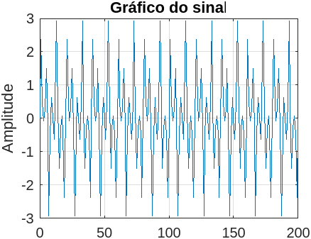
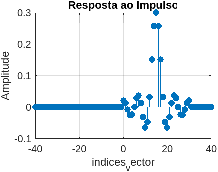

# Linear-systems-codes
Repositório feito com intenção de salvar códigos feitos durante a disciplina de sistema linear

%antonio assis de sousa neto - 390173

#1-) Gere um sinal que é a soma de três funções seno com frequências angulares discretas iguais a 0,2T, 0,5π е 0,8¹; e amplitudes iguais a 1, 1,5 e 0,5, ou seja: 
 -> x[n] = sen(0,2.TT.n) + 1,5.sen(0,5.T.n) + 0,5.sen(0,8.TT.n).
Este sinal deve possuir N=200 pontos. Gere o gráfico deste sinal [sin,figure, plot ou stem].

2-) Gere uma resposta ao impulso de um sistema LIT dada por:
h[n] = sen(0,3 π (n-15))/(π (n-15)), para 0<= n <= 30, n diferente de 15
h[n] = 0,3, para n=15.
h[n] = 0, caso contrário,
Gere o gráfico desta resposta ao impulso [sin, figure,stem].

% 3-) Filtre o sinal de questão 1 usando a resposta ao impulso gerada na questão 2. Gere o
% gráfico deste sinal filtrado [conv,figure,plot].

%4-) O que é observado na questão 3?

% Pode ser observado que mesmo que o sinal de entrada e o sinal inpulso
%tenham sinais não periódicos e com amplitudes diferetentes a convolução
%ou filtrageme entre os dois sinais gerou um sinal periódico que varia 
%sua amplitude entre -1 e 1, com isso dá para perceber que o filtro
%aplicado está afetando de forma a limitar a amplitude do sinal
